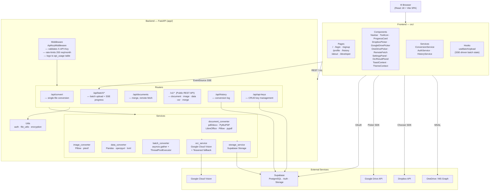

<div align="center">

# 🚀 Xvert — Universal File Conversion Platform

**Convert any file, instantly. No installs, no limits, no nonsense.**

[](https://xvert-pink.vercel.app)
[](https://fastapi.tiangolo.com/)
[](https://react.dev/)
[](https://supabase.com/)
[](LICENSE)

<br/>

> Xvert is a full-stack, browser-based file conversion toolkit covering documents, images, and structured data — with OCR, batch processing, cloud import, and a developer REST API.

</div>

---

## ✨ Features

### 📄 Document Conversions
| Tool | Description |
|---|---|
| **PDF → Word** | Convert PDF files to editable `.docx` with symbol post-processing |
| **Word → PDF** | Convert `.docx` / `.doc` to PDF via LibreOffice (cross-platform) |
| **Image → PDF** | Pack JPG, PNG, or GIF images into a PDF document |
| **Merge PDF** | Combine multiple PDFs into one unified document |
| **Compress PDF** | Reduce PDF file size using stream deflation |
| **Split PDF** | Extract specific pages using range syntax (e.g. `1-3, 5, 7`) |
| **PDF → JPG / PNG** | Render PDF pages to images |
| **OCR → Word** | Extract text from scanned images or PDFs into a `.docx` |

### 🖼️ Image Conversions
| Tool | Description |
|---|---|
| **JPG ↔ PNG ↔ GIF** | Lossless format interchange |
| **Compress Image** | Quality-controlled compression (JPG, PNG, GIF) |
| **Scrub EXIF Data** | Strip GPS, camera, and other privacy metadata |

### 📊 Data Conversions
| From | To |
|---|---|
| JSON | CSV · XML · Excel |
| CSV | JSON · XML · Excel |
| Excel (XLSX/XLS) | CSV · JSON · XML |
| XML | JSON · CSV · Excel |

---

## 🌟 Platform Highlights

| Feature | Details |
|---|---|
| **Batch Conversion** | Upload up to 20 files at once; real-time per-file progress via SSE |
| **Cloud Import** | Drag from Google Drive or Dropbox — no download required |
| **Remote URL Fetch** | Paste any public file URL for instant conversion |
| **Smart Router** | Drop a file on the home screen; Xvert detects the type and suggests all valid conversions |
| **OCR Engine** | Tesseract-powered text extraction with Google Cloud Vision fallback |
| **Developer REST API** | API key authentication, `/v1/convert/*` endpoints, JSON responses with download tokens |
| **Conversion History** | Logged per user via Supabase; accessible from the dashboard |
| **Advanced Options** | Page ranges, image dimensions, quality sliders, EXIF scrubbing, PDF compression |
| **Privacy First** | Files are processed in-memory or in temp storage and never persisted on disk |

---

## 🏗️ Architecture

### System Flow



---

### Directory Tree

```
Xvert/
│
├── frontend/                         # React 18 + Vite SPA
│   └── src/
│       ├── App.jsx                   # Router + ThemeProvider + ToastProvider
│       ├── pages/
│       │   ├── Home.jsx              # Main conversion UI (Smart Router, tool grid, batch)
│       │   ├── Dashboard.jsx         # User dashboard
│       │   ├── DeveloperPortal.jsx   # API key management + docs
│       │   ├── History.jsx           # Conversion history log
│       │   ├── Profile.jsx           # Account settings
│       │   ├── About.jsx
│       │   ├── Login.jsx / Signup.jsx / ForgotPassword.jsx / UpdatePassword.jsx
│       ├── components/
│       │   ├── Navbar.jsx            # App-wide navigation
│       │   ├── ToolIcon.jsx          # Format icon renderer
│       │   ├── ProgressCard.jsx      # Per-file SSE progress card
│       │   ├── BatchUploader.jsx     # Batch drop-zone
│       │   ├── DropboxPicker.jsx / DropboxSaver.jsx
│       │   ├── GoogleDrivePicker.jsx / GoogleDriveSaver.jsx
│       │   ├── OneDrivePicker.jsx
│       │   ├── RemoteFetch.jsx       # URL → file import
│       │   ├── OcrResultPanel.jsx    # OCR text display
│       │   ├── SettingsPanel.jsx     # Advanced conversion options
│       │   ├── ThemeContext.jsx      # Dark / light mode
│       │   ├── ToastContext.jsx      # Global toast notifications
│       │   └── AntiGravityBackground.jsx
│       ├── hooks/
│       │   └── useBatchUpload.js     # POST files → SSE progress stream lifecycle
│       ├── services/
│       │   ├── ConversionService.js  # All conversion API calls (single, batch, remote)
│       │   ├── AuthService.js        # Supabase auth helpers
│       │   └── HistoryService.js     # Conversion history API calls
│       └── config/
│           └── api.js                # API base URL (dev proxy / production env)
│
└── backend/                          # FastAPI Python service
    └── app/
        ├── main.py                   # App init, CORS, router registration
        ├── config.py                 # Settings, env vars, file-size limits
        ├── middleware/
        │   └── api_auth.py           # X-API-Key validation + rate limiting + usage logging
        ├── models/
        │   └── schemas.py            # Pydantic request/response schemas
        ├── routers/
        │   ├── convert.py            # POST /api/convert/*  (single-file)
        │   ├── batch.py              # POST /api/batch/convert  +  GET /api/batch/progress/{id}
        │   ├── documents.py          # POST /api/merge, /api/remote-convert
        │   ├── public_api.py         # /v1/convert/{document|image|data|ocr|merge-pdf}
        │   ├── api_keys.py           # CRUD /api/api-keys
        │   └── history.py            # GET/POST /api/history
        ├── services/
        │   ├── document_converter.py # pdf2docx, PyMuPDF, LibreOffice, pypdf, Pillow
        │   ├── image_converter.py    # Pillow, piexif (EXIF scrub)
        │   ├── data_converter.py     # Pandas, openpyxl, lxml
        │   ├── batch_converter.py    # asyncio.gather + per-file SSE queue
        │   ├── ocr_service.py        # Google Cloud Vision + Tesseract fallback → DOCX
        │   └── storage_service.py    # Supabase Storage upload/download
        └── utils/
            ├── auth.py               # JWT / Supabase token verification
            ├── file_utils.py         # Extension detection, temp-file helpers, size validation
            └── encryption.py        # API key hashing (SHA-256)
```

---

### Tech Stack

| Layer | Technology |
|---|---|
| **Frontend** | React 18, Vite, React Router, Framer Motion, Lucide Icons |
| **Backend** | FastAPI, Uvicorn, asyncio, `asyncio.to_thread` (ThreadPoolExecutor) |
| **Auth & DB** | Supabase (PostgreSQL + GoTrue Auth + Storage) |
| **Document** | pdf2docx, PyMuPDF (fitz), pypdf, LibreOffice headless (DOCX→PDF), Pillow |
| **Image** | Pillow, piexif (EXIF metadata scrubbing) |
| **Data** | Pandas, openpyxl, lxml |
| **OCR** | Google Cloud Vision (primary) + Tesseract / pytesseract (fallback) |
| **Cloud Storage** | Dropbox JS SDK, Google Picker API, Microsoft Graph / MSAL (OneDrive) |
| **Batch** | SSE (`text/event-stream`) — one queue per batch, `asyncio.gather` per file |
| **Middleware** | Custom `ApiKeyMiddleware` — key hash lookup, 200 req/month rate limit, usage logging |
| **Deployment** | Vercel (frontend) · Render + Docker (backend) |


---

## 🚀 Quick Start (Local Development)

### Prerequisites

- **Node.js** ≥ 18 — [nodejs.org](https://nodejs.org/)
- **Python** ≥ 3.11 — [python.org](https://www.python.org/)
- **Tesseract OCR** *(required for OCR tools)*
  - Windows: [UB-Mannheim installer](https://github.com/UB-Mannheim/tesseract/wiki) — add to PATH
  - macOS: `brew install tesseract`
  - Linux: `sudo apt install tesseract-ocr`
- **LibreOffice** *(required for Word ↔ PDF)*
  - Windows/macOS: [libreoffice.org](https://www.libreoffice.org/download/)
  - Linux: `sudo apt install libreoffice`

---

### 1 · Clone the repository

```bash
git clone https://github.com/saloni080613/Xvert.git
cd Xvert
```

---

### 2 · Backend Setup

```bash
cd backend

# Create and activate a virtual environment
python -m venv .venv

# Windows
.\.venv\Scripts\activate
# macOS / Linux
source .venv/bin/activate

# Install dependencies
pip install -r requirements.txt

# Copy and configure environment variables
cp .env.example .env   # then fill in values (see Environment Variables below)

# Start the API server
uvicorn app.main:app --reload --port 8000
```

API will be live at **`http://localhost:8000`** · Interactive docs at **`http://localhost:8000/docs`**

---

### 3 · Frontend Setup

```bash
cd frontend

# Install dependencies
npm install

# Copy and configure environment variables
cp .env.example .env   # set VITE_API_URL if needed

# Start the dev server
npm run dev
```

App will be live at **`http://localhost:5173`**

---

### One-command start (Windows)

```bat
start.bat
```

---

## ⚙️ Environment Variables

### Backend (`backend/.env`)

```env
# Supabase
SUPABASE_URL=https://your-project.supabase.co
SUPABASE_KEY=your-supabase-anon-or-service-key

# Frontend origin (for CORS)
FRONTEND_URL=http://localhost:5173

# Google Cloud Vision OCR (optional — falls back to Tesseract)
GOOGLE_APPLICATION_CREDENTIALS=/path/to/service-account.json
GOOGLE_VISION_ENABLED=false

# Email (optional — Resend)
RESEND_API_KEY=re_your_key_here
```

### Frontend (`frontend/.env`)

```env
# Leave empty in development (Vite proxy handles /api → localhost:8000)
VITE_API_URL=

# Supabase
VITE_SUPABASE_URL=https://your-project.supabase.co
VITE_SUPABASE_ANON_KEY=your-supabase-anon-key

# Cloud pickers (optional)
VITE_DROPBOX_APP_KEY=your-dropbox-app-key
VITE_GOOGLE_CLIENT_ID=your-google-oauth-client-id
VITE_GOOGLE_API_KEY=your-google-api-key
VITE_GOOGLE_PICKER_APP_ID=your-google-app-id
```

---

## 🔌 Developer REST API

Xvert exposes a versioned public API for programmatic access. Generate an API key from your dashboard.

All `/v1` requests require the header:
```
X-API-Key: xvt_your_api_key
```

### Endpoints

| Method | Path | Description |
|---|---|---|
| `POST` | `/v1/convert/document` | Convert PDF ↔ DOCX |
| `POST` | `/v1/convert/image` | Convert between image formats |
| `POST` | `/v1/convert/data` | Convert JSON / CSV / Excel / XML |
| `POST` | `/v1/convert/ocr` | OCR a scanned image or PDF → DOCX or TXT |
| `POST` | `/v1/convert/merge-pdf` | Merge multiple PDFs |
| `GET` | `/v1/download/{token}` | Download a converted file (5-min TTL) |
| `POST` | `/api/batch/convert` | Upload up to 20 files for batch processing |
| `GET` | `/api/batch/progress/{batch_id}` | SSE stream of per-file progress |

### Example — Convert a document

```bash
curl -X POST https://your-backend/v1/convert/document \
  -H "X-API-Key: xvt_your_key" \
  -F "file=@report.pdf" \
  -F "target_format=docx"
```

```json
{
  "success": true,
  "download_url": "/v1/download/abc123token",
  "filename": "converted.docx",
  "expires_in_seconds": 300
}
```

Full interactive API docs available at `/docs` (Swagger UI).

---

## 🐳 Docker Deployment (Backend)

```bash
cd backend
docker build -t xvert-api .
docker run -p 8000:8000 --env-file .env xvert-api
```

The Dockerfile installs Tesseract, LibreOffice, and all Python dependencies.

---

## 🤝 Contributing

Contributions are welcome! Please open an issue first to discuss your proposed change.

```bash
# Work on a feature branch
git checkout -b feature/my-feature

git add .
git commit -m "feat: describe your change"
git push origin feature/my-feature
# → open a Pull Request against develop
```

---

## 📄 License

This project is licensed under the **MIT License** — see the [LICENSE](LICENSE) file for details.

---

<div align="center">

Made with ❤️ by [saloni080613](https://github.com/saloni080613)

⭐ Star this repo if Xvert saved you time!

</div>
