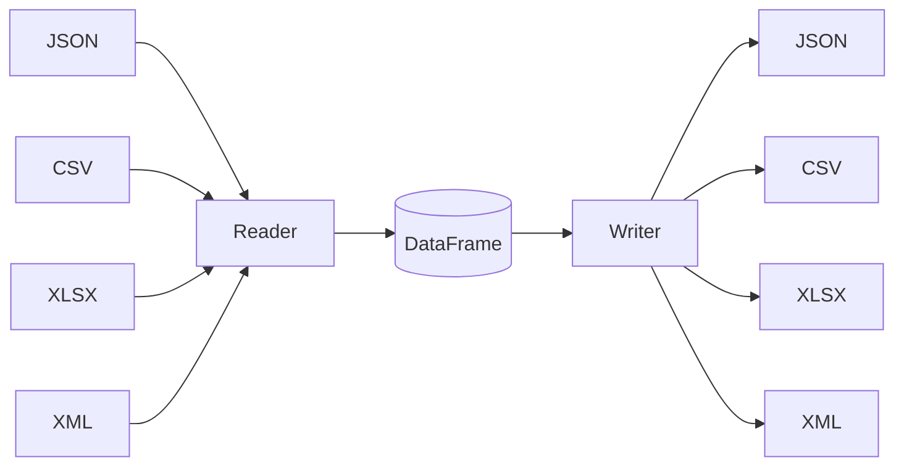

# Data Conversion API - Walkthrough

Implementation of FastAPI data conversion endpoints supporting **JSON, CSV, XLSX, XML** formats with a **hub-and-spoke architecture**.

---

## What Was Built

### Files Created

| File | Purpose |
|------|---------|
| [data_converter.py](file:///c:/Users/Salonee/OneDrive/Desktop/project/Xvert/backend/app/services/data_converter.py) | Core conversion logic using Pandas + xmltodict |

### Files Modified

| File | Change |
|------|--------|
| [convert.py](file:///c:/Users/Salonee/OneDrive/Desktop/project/Xvert/backend/app/routers/convert.py) | Added `/api/convert/data` endpoint |
| [file_utils.py](file:///c:/Users/Salonee/OneDrive/Desktop/project/Xvert/backend/app/utils/file_utils.py) | Added data format utilities |
| [requirements.txt](file:///c:/Users/Salonee/OneDrive/Desktop/project/Xvert/backend/requirements.txt) | Added `lxml`, `xmltodict` dependencies |

---

## Architecture: Hub-and-Spoke Model

Instead of writing 12 separate converters (4 formats × 3 targets), we use **DataFrame as central hub**:



### Benefits
- **8 functions** instead of 12 (4 readers + 4 writers)
- Adding new format = only 2 new functions
- Leverages Pandas' optimized I/O operations

### Special Cases
| Conversion | Approach |
|------------|----------|
| XML ↔ JSON | **Hierarchical** (preserves tree structure) |
| XML ↔ CSV/XLSX | **Tabular** (flattens to columns) |

---

## Format Characteristics

| Format | Structure | Library | Best For |
|--------|-----------|---------|----------|
| JSON | Hierarchical/Array | pandas, json | APIs, configs |
| CSV | Tabular rows | pandas | Spreadsheet data |
| XLSX | Excel workbook | pandas + openpyxl | Rich spreadsheets |
| XML | Tree/Hierarchical | lxml + xmltodict | Document interchange |

---

## API Endpoints

### POST `/api/convert/data`

Convert a data file to a different format.

**Request:**
```
Content-Type: multipart/form-data

- file: (binary) Data file to convert
- source_format: (optional) json, csv, xlsx, xml - auto-detected if not provided
- target_format: (required) json, csv, xlsx, xml
```

**Response:** Converted file with appropriate content type

**Response Headers:**
- `X-Row-Count`: Number of data rows
- `X-Column-Count`: Number of columns

### GET `/api/convert/data/formats`

Get list of supported data formats.

**Response:**
```json
{
  "supported_formats": ["json", "csv", "xlsx", "xml"],
  "architecture": "hub-and-spoke with DataFrame as central hub",
  "notes": {
    "xml_json": "XML↔JSON preserves hierarchical structure",
    "tabular": "CSV/XLSX conversions flatten to tabular format"
  }
}
```

---

## Example Outputs

### XML → JSON (Hierarchical)

**Input XML:**
```xml
<root xmlns:books="http://example.com/books">
  <books:library>
    <books:book>
      <books:title>The Great Gatsby</books:title>
    </books:book>
  </books:library>
</root>
```

**Output JSON:**
```json
{
  "root": {
    "_xmlns:books": "http://example.com/books",
    "books:library": {
      "books:book": {
        "books:title": "The Great Gatsby"
      }
    }
  }
}
```

### CSV → JSON

**Input CSV:**
```
name,age,city
Alice,30,NYC
Bob,25,LA
```

**Output JSON:**
```json
[
  {"name": "Alice", "age": 30, "city": "NYC"},
  {"name": "Bob", "age": 25, "city": "LA"}
]
```

---

## Testing

### Server Started Successfully

```
INFO:     Uvicorn running on http://127.0.0.1:8000
```

### Manual Testing (via Swagger UI)

1. Navigate to `http://localhost:8000/docs`
2. Expand **POST /api/convert/data**
3. Click "Try it out"
4. Upload a file and set target_format
5. Execute and download the result

### Manual Testing (via curl)

```powershell
# CSV to JSON
curl -X POST "http://localhost:8000/api/convert/data" `
  -F "file=@data.csv" `
  -F "target_format=json" `
  -o output.json

# JSON to XML
curl -X POST "http://localhost:8000/api/convert/data" `
  -F "file=@data.json" `
  -F "target_format=xml" `
  -o output.xml
```

---

## Dependencies Added

| Package | Version | Purpose |
|---------|---------|---------|
| pandas | ≥2.0 | DataFrame operations |
| openpyxl | ≥3.0 | Excel file handling |
| lxml | ≥4.9 | XML parsing |
| xmltodict | ≥1.0 | Hierarchical XML↔JSON |

Install with:
```bash
pip install -r requirements.txt
```
