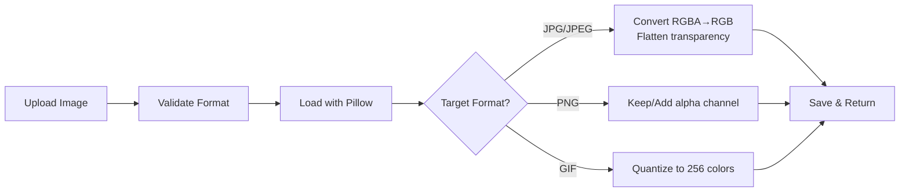

# Image Conversion API - Walkthrough

Implementation of FastAPI image conversion endpoints supporting **PNG, JPG, JPEG, GIF** formats.

---

## What Was Built

### Files Created

| File | Purpose |
|------|---------|
| [image_converter.py](file:///c:/Users/Salonee/OneDrive/Desktop/project/Xvert/backend/app/services/image_converter.py) | Core conversion logic using Pillow |
| [convert.py](file:///c:/Users/Salonee/OneDrive/Desktop/project/Xvert/backend/app/routers/convert.py) | API router with `/api/convert/image` endpoint |
| [schemas.py](file:///c:/Users/Salonee/OneDrive/Desktop/project/Xvert/backend/app/models/schemas.py) | Pydantic request/response models |
| [file_utils.py](file:///c:/Users/Salonee/OneDrive/Desktop/project/Xvert/backend/app/utils/file_utils.py) | Helper functions for file handling |

### Files Modified

| File | Change |
|------|--------|
| [main.py](file:///c:/Users/Salonee/OneDrive/Desktop/project/Xvert/backend/app/main.py) | Added convert router import and registration |
| [config.py](file:///c:/Users/Salonee/OneDrive/Desktop/project/Xvert/backend/app/config.py) | Updated allowed image types (removed WebP, BMP) |

---

## Image Conversion Theory

### How It Works



### Format Characteristics

| Format | Transparency | Colors | Compression | Best For |
|--------|-------------|--------|-------------|----------|
| PNG | ✅ Full alpha | Unlimited | Lossless | Logos, screenshots |
| JPG/JPEG | ❌ None | Unlimited | Lossy | Photos |
| GIF | ⚠️ 1-bit only | 256 max | Lossless | Simple animations |

### Key Conversion Challenges

1. **PNG → JPG**: Alpha channel must be removed (flattened to white background)
2. **GIF → Others**: Only first frame extracted (animation lost)
3. **Any → GIF**: Colors quantized to 256-color palette

---

## API Endpoints

### POST `/api/convert/image`

Convert an image to a different format.

**Request:**
```
Content-Type: multipart/form-data

- file: (binary) Image to convert
- source_format: (optional) png, jpg, jpeg, gif
- target_format: (required) png, jpg, jpeg, gif
```

**Response:** Binary image file with `Content-Disposition: attachment`

### GET `/api/convert/formats`

Get list of supported formats.

**Response:**
```json
{
  "supported_formats": ["png", "gif", "jpg", "jpeg"],
  "notes": {
    "jpg_jpeg": "JPG and JPEG are equivalent",
    "transparency": "PNG supports transparency, JPG/JPEG do not",
    "animation": "GIF animation is not preserved when converting",
    "colors": "GIF is limited to 256 colors"
  }
}
```

---

## Testing

### Server Started Successfully

```
INFO:     Uvicorn running on http://127.0.0.1:8000
```

### API Verified

```bash
GET http://127.0.0.1:8000/api/convert/formats
# Response: 200 OK
# {"supported_formats":["png","gif","jpg","jpeg"],...}
```

### Manual Testing (via Swagger UI)

1. Navigate to `http://localhost:8000/docs`
2. Expand **POST /api/convert/image**
3. Click "Try it out"
4. Upload an image and set target_format
5. Execute and download the result

### Manual Testing (via curl)

```powershell
# PNG to JPG
curl -X POST "http://localhost:8000/api/convert/image" `
  -F "file=@test.png" `
  -F "target_format=jpg" `
  -o output.jpg

# JPG to PNG  
curl -X POST "http://localhost:8000/api/convert/image" `
  -F "file=@test.jpg" `
  -F "target_format=png" `
  -o output.png
```

---

## Next Steps

- [ ] Test with actual images via Swagger UI or curl
- [ ] Add Supabase storage integration
- [ ] Implement document/data conversion endpoints
