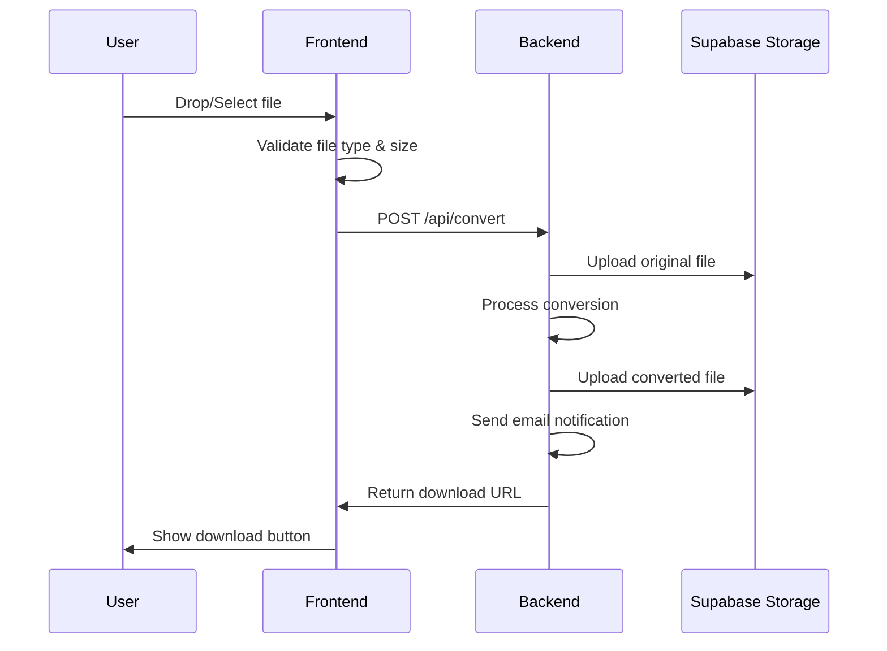

# FileForge - File Converter Application

A full-stack file conversion platform with React frontend, Python FastAPI backend, and Supabase for authentication, database, and storage.

## User Review Required

> [!IMPORTANT]
> **Project Name**: Using "FileForge" as the project name. Let me know if you prefer a different name.

> [!NOTE]
> **Docker**: Not required for initial development or deployment. Can be added later if needed for audio conversion (FFmpeg).

---

## Tech Stack Overview

| Layer | Technology | Purpose |
|-------|------------|---------|
| Frontend | React + Vite | Modern, fast UI |
| Backend | Python + FastAPI | File processing APIs |
| Database | Supabase (PostgreSQL) | User data, conversion history |
| Storage | Supabase Storage | File uploads and converted files |
| Auth | Supabase Auth | User registration/login |
| Email | Resend (free tier) | Completion notifications |
| Hosting | Vercel + Render | Free tier deployment |

---

## Project Structure

```
cosmic-aurora/
├── frontend/                    # React Vite application
│   ├── public/
│   ├── src/
│   │   ├── components/
│   │   │   ├── common/
│   │   │   │   ├── Navbar.jsx
│   │   │   │   ├── Footer.jsx
│   │   │   │   └── LoadingSpinner.jsx
│   │   │   ├── auth/
│   │   │   │   ├── LoginForm.jsx
│   │   │   │   └── SignupForm.jsx
│   │   │   ├── converter/
│   │   │   │   ├── FileUpload.jsx
│   │   │   │   ├── FormatSelector.jsx
│   │   │   │   ├── ConversionProgress.jsx
│   │   │   │   └── DownloadButton.jsx
│   │   │   └── dashboard/
│   │   │       ├── ConversionHistory.jsx
│   │   │       ├── ShareableLink.jsx
│   │   │       └── UserStats.jsx
│   │   ├── pages/
│   │   │   ├── Home.jsx
│   │   │   ├── Login.jsx
│   │   │   ├── Signup.jsx
│   │   │   ├── Convert.jsx
│   │   │   ├── Dashboard.jsx
│   │   │   └── SharedFile.jsx
│   │   ├── services/
│   │   │   ├── supabase.js
│   │   │   └── api.js
│   │   ├── hooks/
│   │   │   ├── useAuth.js
│   │   │   └── useConversion.js
│   │   ├── context/
│   │   │   └── AuthContext.jsx
│   │   ├── styles/
│   │   │   └── index.css
│   │   ├── App.jsx
│   │   └── main.jsx
│   ├── package.json
│   └── vite.config.js
│
├── backend/                     # Python FastAPI application
│   ├── app/
│   │   ├── __init__.py
│   │   ├── main.py              # FastAPI entry point
│   │   ├── config.py            # Environment config
│   │   ├── routers/
│   │   │   ├── __init__.py
│   │   │   ├── convert.py       # Conversion endpoints
│   │   │   ├── files.py         # File management
│   │   │   └── share.py         # Shareable links
│   │   ├── services/
│   │   │   ├── __init__.py
│   │   │   ├── image_converter.py
│   │   │   ├── document_converter.py
│   │   │   ├── data_converter.py
│   │   │   ├── supabase_service.py
│   │   │   └── email_service.py
│   │   ├── models/
│   │   │   ├── __init__.py
│   │   │   └── schemas.py       # Pydantic models
│   │   └── utils/
│   │       ├── __init__.py
│   │       └── file_utils.py
│   ├── requirements.txt
│   └── .env.example
│
├── .gitignore
└── README.md
```

---

## Database Schema (Supabase)

### Tables

#### `profiles` (extends Supabase auth.users)
```sql
CREATE TABLE profiles (
  id UUID REFERENCES auth.users(id) PRIMARY KEY,
  email TEXT NOT NULL,
  full_name TEXT,
  avatar_url TEXT,
  email_notifications BOOLEAN DEFAULT true,
  created_at TIMESTAMPTZ DEFAULT NOW(),
  updated_at TIMESTAMPTZ DEFAULT NOW()
);
```

#### `conversions`
```sql
CREATE TABLE conversions (
  id UUID PRIMARY KEY DEFAULT gen_random_uuid(),
  user_id UUID REFERENCES profiles(id) ON DELETE CASCADE,
  original_filename TEXT NOT NULL,
  original_format TEXT NOT NULL,
  converted_format TEXT NOT NULL,
  original_file_url TEXT,
  converted_file_url TEXT,
  file_size_original BIGINT,
  file_size_converted BIGINT,
  status TEXT DEFAULT 'pending',  -- pending, processing, completed, failed
  error_message TEXT,
  created_at TIMESTAMPTZ DEFAULT NOW(),
  completed_at TIMESTAMPTZ
);
```

#### `shared_links`
```sql
CREATE TABLE shared_links (
  id UUID PRIMARY KEY DEFAULT gen_random_uuid(),
  conversion_id UUID REFERENCES conversions(id) ON DELETE CASCADE,
  user_id UUID REFERENCES profiles(id) ON DELETE CASCADE,
  share_token TEXT UNIQUE NOT NULL,
  expires_at TIMESTAMPTZ NOT NULL,
  download_count INTEGER DEFAULT 0,
  max_downloads INTEGER DEFAULT 10,
  is_active BOOLEAN DEFAULT true,
  created_at TIMESTAMPTZ DEFAULT NOW()
);
```

---

## Proposed Changes

### Frontend (React + Vite)

---

#### [NEW] [frontend/](file:///c:/Users/Salonee/.gemini/antigravity/playground/cosmic-aurora/frontend)

Initialize React app with Vite:
- Configure React Router for navigation
- Set up Supabase client for auth
- Create responsive, modern UI with CSS
- Implement drag-and-drop file upload
- Build conversion progress indicators
- Create user dashboard with history

Key dependencies:
```json
{
  "react": "^18.2.0",
  "react-router-dom": "^6.x",
  "@supabase/supabase-js": "^2.x",
  "react-dropzone": "^14.x",
  "axios": "^1.x"
}
```

---

### Backend (Python + FastAPI)

---

#### [NEW] [backend/](file:///c:/Users/Salonee/.gemini/antigravity/playground/cosmic-aurora/backend)

Python FastAPI server with:

**Conversion Endpoints:**
- `POST /api/convert/image` - Image format conversion
- `POST /api/convert/document` - Document conversion
- `POST /api/convert/data` - Data file conversion
- `GET /api/conversions/{id}` - Get conversion status

**File Management:**
- `GET /api/files/history` - User's conversion history
- `DELETE /api/files/{id}` - Delete a conversion

**Sharing:**
- `POST /api/share/create` - Generate shareable link
- `GET /api/share/{token}` - Access shared file
- `DELETE /api/share/{id}` - Revoke share link

**Notifications:**
- Email sent on conversion completion using Resend API

Key dependencies:
```
fastapi==0.109.0
uvicorn==0.27.0
python-multipart==0.0.6
pillow==10.2.0          # Image conversion
python-docx==1.1.0      # Word documents
pdf2docx==0.5.6         # PDF to Word
markdown==3.5.1         # Markdown processing
pandas==2.1.4           # CSV/Excel/JSON
openpyxl==3.1.2         # Excel files
supabase==2.3.0         # Supabase client
resend==0.7.0           # Email notifications
python-dotenv==1.0.0
```

---

## Supported Conversions

### Core (MVP)

| Category | Input Formats | Output Formats |
|----------|---------------|----------------|
| **Images** | PNG, JPG, JPEG, WebP, BMP, GIF | PNG, JPG, WebP, BMP |
| **Documents** | PDF, DOCX, MD, HTML, TXT | PDF, DOCX, HTML, TXT |
| **Data** | JSON, CSV, XLSX, XML | JSON, CSV, XLSX |

### Optional (Later)

| Category | Input Formats | Output Formats | Library |
|----------|---------------|----------------|---------|
| **Audio** | MP3, WAV, OGG, FLAC | MP3, WAV, OGG | pydub + FFmpeg |

---

## Feature Implementation Details

### 1. File Upload Flow



### 2. Shareable Links

- Generate unique token (UUID + random string)
- Set expiration (default: 7 days)
- Track download count
- Allow user to revoke access
- Public page for accessing shared files (no auth required)

### 3. Email Notifications

Using **Resend** (free tier: 100 emails/day):
- Send email when conversion completes
- Include download link in email
- User can toggle notifications in settings

---

## Environment Variables

### Frontend (.env)
```
VITE_SUPABASE_URL=your_supabase_url
VITE_SUPABASE_ANON_KEY=your_anon_key
VITE_API_URL=http://localhost:8000
```

### Backend (.env)
```
SUPABASE_URL=your_supabase_url
SUPABASE_KEY=your_service_role_key
RESEND_API_KEY=your_resend_api_key
FRONTEND_URL=http://localhost:5173
```

---

## Verification Plan

### Automated Tests

#### Backend API Tests
```bash
# Navigate to backend directory
cd backend

# Install test dependencies
pip install pytest pytest-asyncio httpx

# Run tests
pytest tests/ -v
```

Tests to implement:
- `test_image_conversion.py` - Test PNG→JPG, JPG→WebP, etc.
- `test_document_conversion.py` - Test PDF→DOCX, MD→HTML
- `test_data_conversion.py` - Test JSON→CSV, CSV→XLSX
- `test_share_links.py` - Test link creation, expiration, access

#### Frontend Tests
```bash
cd frontend
npm run test
```

### Manual Verification

1. **Authentication Flow**
   - Sign up with email
   - Verify login/logout works
   - Check profile page loads

2. **Conversion Testing**
   - Upload a PNG file → convert to JPG → download and verify
   - Upload a PDF → convert to DOCX → open in Word
   - Upload JSON → convert to CSV → open in Excel

3. **Shareable Links**
   - Create a share link
   - Open link in incognito browser (no auth)
   - Verify file downloads
   - Test expiration (set to 1 minute for testing)

4. **Email Notifications**
   - Convert a file
   - Check email arrives with download link
   - Verify link in email works

### Browser Testing
After development, use the browser tool to:
- Navigate through all pages
- Test file upload via UI
- Verify responsive design
- Check error handling

---

## Development Order

| Phase | Tasks | Duration |
|-------|-------|----------|
| **1. Setup** | Initialize projects, Supabase config | Day 1 |
| **2. Auth** | Login, Signup, Protected routes | Day 1-2 |
| **3. Upload UI** | File upload component, format selector | Day 2-3 |
| **4. Backend Core** | FastAPI setup, image conversion | Day 3-4 |
| **5. Document Conv** | PDF/Word/Markdown conversion | Day 4-5 |
| **6. Data Conv** | JSON/CSV/Excel conversion | Day 5 |
| **7. History** | Dashboard, conversion history | Day 6 |
| **8. Sharing** | Shareable links feature | Day 6-7 |
| **9. Notifications** | Email on completion | Day 7 |
| **10. Polish** | UI refinement, error handling | Day 8 |
| **11. Deploy** | Vercel + Render deployment | Day 8-9 |
| **12. Optional** | Batch, presets, dark mode | Day 10+ |

---

## Deployment Plan

### Frontend → Vercel
1. Connect GitHub repository
2. Set environment variables
3. Auto-deploy on push to main

### Backend → Render
1. Create new Web Service
2. Set build command: `pip install -r requirements.txt`
3. Set start command: `uvicorn app.main:app --host 0.0.0.0 --port $PORT`
4. Add environment variables
5. Free tier: spins down after 15 min inactivity (acceptable for portfolio)

### Supabase
1. Create project (free tier)
2. Run SQL migrations for tables
3. Configure storage buckets
4. Set up Row Level Security (RLS) policies

---

## Optional Features (Time Permitting)

| Feature | Complexity | Notes |
|---------|------------|-------|
| Batch conversion | Medium | Queue multiple files, ZIP download |
| Conversion presets | Low | Save favorite format settings |
| Dark/Light mode | Low | CSS variables + toggle |
| Audio conversion | High | Requires FFmpeg, possibly Docker |
| API access | Medium | Generate API keys, rate limiting |
| PWA | Low | Service worker + manifest |
| i18n | Medium | react-i18next setup |

